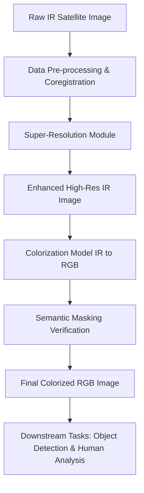
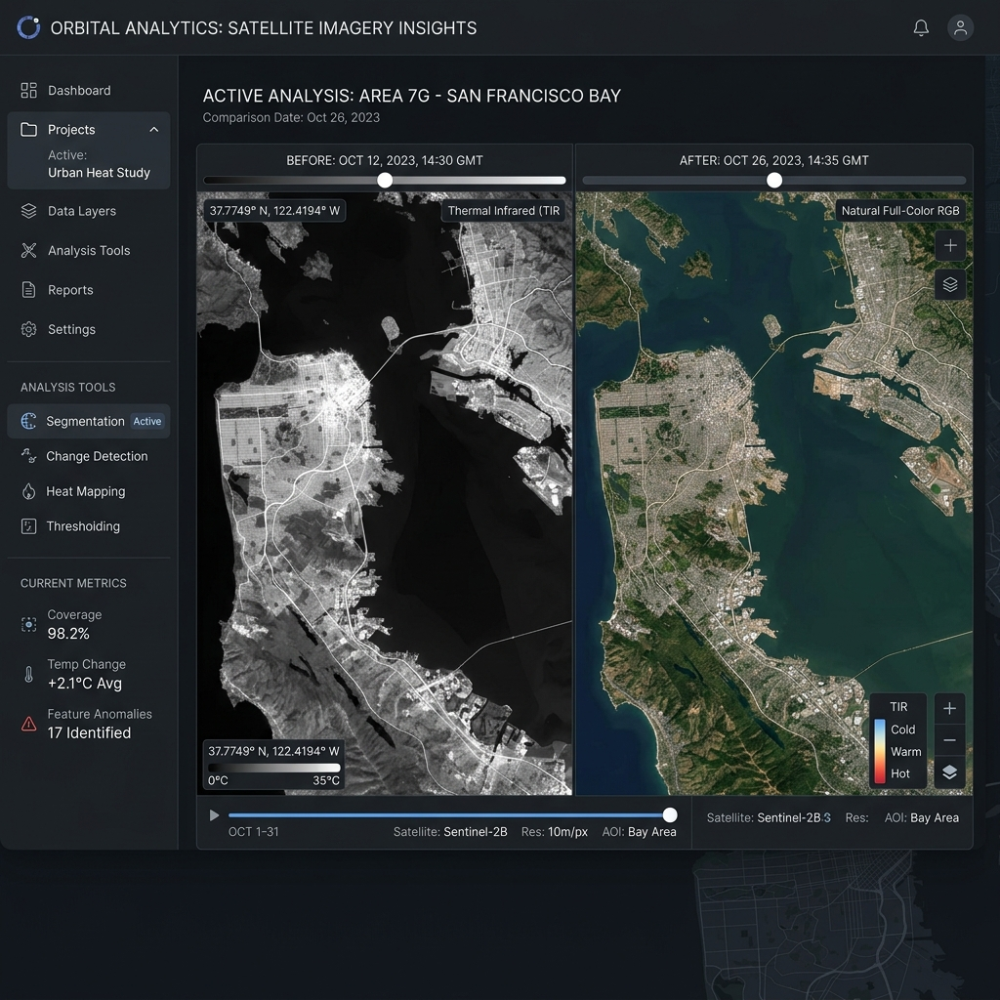
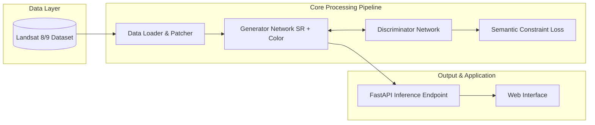

# VisionForge: Presentation Content

Here is the slide-by-slide content tailored for your PowerPoint submission round.

## Slide 1: The Opportunity
**The Challenge:** Satellite remote sensing frequently relies on infrared (IR) sensors during night time or adverse weather. However, raw IR images are monochrome, suffer from low contrast, and lack semantic textures, making it difficult for both human analysts and automated AI models to identify critical objects like vehicles, buildings, or vegetation.
**The Opportunity:** By developing an end-to-end deep learning framework, we can simultaneously super-resolve (sharpen) these IR images and map them to realistic RGB colorizations. This transforms low-visibility thermal data into high-fidelity imagery, drastically improving situational awareness and the accuracy of downstream object detection tasks without introducing hallucinated artifacts.

## Slide 2: Features Offered by the Solution
1. **Super-Resolution Enhancement:** Upscales low-resolution IR imagery and sharpens faint edges/textures for enhanced structural detail.
2. **Realistic IR-to-RGB Colorization:** Leverages advanced image-to-image translation (e.g., CycleGAN/Pix2Pix) to predictably map thermal features to natural colors.
3. **Semantic Integrity Preservation:** Uses pre-trained land-cover classifiers and semantic masks to guarantee objects are colored correctly (e.g., water bodies are blue, forests are green).
4. **Automated Quality Evaluation:** Built-in calculation of PSNR, SSIM, and FID to ensure structural and visual fidelity.
5. **High-Speed Inference:** Optimized models capable of rapidly processing large Landsat 8/9 tiles, ensuring the solution is scalable.

## Slide 3: Process Flow Diagram

## Slide 4: Wireframe / Mock Diagram of Proposed Solution
*A concept for the web dashboard where analysts can compare raw thermal data with the enhanced, colorized output in real-time.*

## Slide 5: Architecture Diagram

## Slide 6: Technologies to be Used
- **Deep Learning Framework:** Python, PyTorch
- **Computer Vision Models:** CycleGAN, Pix2Pix, ESRGAN (for Super Resolution)
- **Geospatial & Image Processing:** OpenCV, Rasterio, GDAL, Scikit-Image
- **Frontend / Dashboard:** React.js / Vite
- **Backend API:** FastAPI
- **Data Source:** Landsat 8/9 via USGS / AWS Earth

## Slide 7: Estimated Implementation Cost
*Assuming a prototype/MVP phase over 1-2 months:*
- **Compute (Model Training):** Cloud GPU Instances (e.g., AWS EC2 p3.2xlarge or Google Cloud A100) - **$500 to $800**
- **Compute (Inference/Hosting):** Standard VPS or Serverless GPU - **$100 / month**
- **Data Storage:** Cloud Object Storage (AWS S3) for high-res TIFF datasets - **$20 to $50 / month**
- **Software/Licenses:** $0 (Fully Open-Source Tech Stack)
- **Total Initial Infrastructure Cost:** ~**$600 - $950** *(Note: This can be reduced to near $0 if leveraging academic compute clusters, ISRO servers, or free tiers like Kaggle/Colab for prototyping).*
